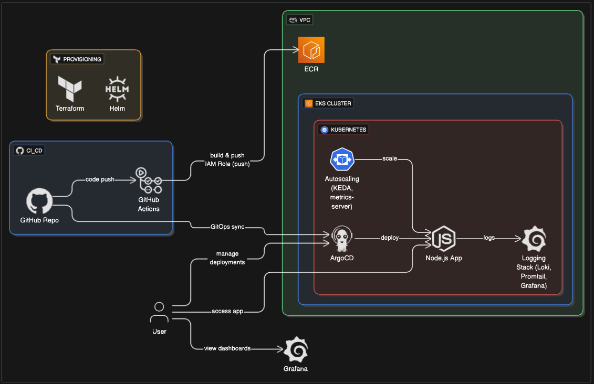

# 🚀 Perion DevOps Home Task - Complete Solution

## 📋 Overview

This repository contains a complete DevOps home assignment for Perion, including infrastructure as code, CI/CD, Kubernetes deployment, and logging on AWS EKS.

## 🎯 Project Goals

### ✅ Task 1: Infrastructure as Code
- [x] **VPC** with public/private subnets in 2 AZs
- [x] **EKS cluster** with managed node groups
- [x] **ECR repository** with image scanning

### ✅ Task 2: Kubernetes Application Deployment
- [x] **Download app** from S3
- [x] **CI/CD pipeline** with GitHub Actions
- [x] **GitOps deployment** with ArgoCD
- [x] **Logging stack** with Loki + Grafana
- [x] **High Availability** with multi-AZ
- [x] **KEDA ScaledObject** with CPU(80%) + cron pre-scaling
- [x] **Cluster Autoscaler** for node management

## 🏗️ Architecture



## 🛠️ Technologies

| Component         | Version  | Role & Description                                      |
|------------------|----------|--------------------------------------------------------|
| **Terraform**    | 1.12.2+  | Infrastructure as Code for AWS resources                |
| **AWS Provider** | 6.3.0+   | AWS resource management for Terraform                   |
| **EKS**          | 1.33     | Managed Kubernetes cluster on AWS                       |
| **ArgoCD**       | 8.1.3    | GitOps deployment and continuous delivery               |
| **Loki**         | 6.31.0   | Log aggregation and storage                             |
| **Promtail**     | latest   | Log shipping from pods to Loki                          |
| **Grafana**      | latest   | Log visualization and dashboarding                      |
| **KEDA**         | latest   | Advanced event-driven and scheduled autoscaling         |
| **metrics-server**| latest  | Resource metrics for HPA/KEDA                          |
| **GitHub Actions**|         | CI/CD pipeline for build, test, and deploy              |
| **Helm**         | 3.18.4   | Kubernetes package manager (charts)                     |

## 📂 Project Structure

- `terraform/` – Full Infrastructure as Code using AWS modules for VPC, EKS, ECR, IAM, and add-ons
- `charts/hello-world-node/` – Helm chart for the Node.js app (Deployment, Service, KEDA scaler, values)
- `argocd/` – ArgoCD application definition and service account for GitOps
- `logging/` – Loki and Promtail Helm values/configuration
- `app/hello-world-node/` – Application source code, Dockerfiles, and basic tests
- `scripts/` – Automation scripts for provisioning, installing tools, and validation
- `docs/` – Documentation, architecture diagram, best practices, and setup requirements
- `.github/workflows/` – CI/CD pipeline (GitHub Actions)

For a detailed explanation of the folder and file organization, see [docs/project-structure.md](./docs/project-structure.md).

## 🚀 Installation & Usage

> **Note:** All setup and utility scripts are located in the `scripts/` directory and should be run from the project root. Ensure you have appropriate AWS credentials and permissions configured.

### Prerequisites

Install all required tools for infrastructure, Kubernetes, and CI/CD: [docs/setup-requirements.md](./docs.setup-requirements.md).

### Step 1: Provision Infrastructure
This script provisions the AWS infrastructure (VPC, EKS, IAM, ECR) using Terraform.
```bash
chmod +x scripts/deploy.sh
./scripts/deploy.sh
```

### Step 2: Connect to the EKS Cluster
After the infrastructure is provisioned, connect to the EKS cluster:
```bash
aws eks update-kubeconfig --region us-east-1 --name omer-perion-cluster
```

### Step 3: Download the Application
This script downloads and extracts the Node.js application from S3, and initializes a local Git repository.
```bash
chmod +x scripts/download-app.sh
./scripts/download-app.sh
```
> **Note:** The script automatically patches `server.js` to add `/health` and `/ready` endpoints for Kubernetes readiness and liveness probes. This enables robust health checks and auto-healing in production environments.

### Step 4: Install ArgoCD
This script installs ArgoCD in the cluster and configures the application for GitOps deployment.
```bash
chmod +x scripts/install-argocd.sh
./scripts/install-argocd.sh
```

### Step 5: Install Logging Stack
This script installs Loki, Promtail, and Grafana for centralized logging and visualization.
```bash
chmod +x scripts/install-loki.sh
./scripts/install-loki.sh
```

### Step 6: Install metrics-server (for HPA/KEDA CPU autoscaling)
This script installs metrics-server in the `kube-system` namespace, required for HPA and KEDA CPU-based scaling.
```bash
chmod +x scripts/install-metrics-server.sh
./scripts/install-metrics-server.sh
```

### Step 7: Install KEDA (for advanced autoscaling)
This script installs KEDA in the `keda` namespace for event-driven and scheduled autoscaling.
```bash
chmod +x scripts/install-keda.sh
./scripts/install-keda.sh
```

### Step 8: Deploy the Application
> **Note:** By default, the application is deployed automatically by ArgoCD (GitOps).
> If you want to deploy manually (for local development or testing), use the following Helm command:
```bash
helm upgrade --install hello-world-node ./helm/hello-world-node \
  --namespace default \
  --create-namespace
```
- This command deploys the Node.js Hello World application to the cluster using Helm.

### Step 9: Validate the Application Deployment
After deploying the application (either via ArgoCD or Helm), you can validate the deployment using the provided script:
```bash
chmod +x scripts/validate-helm-deployment.sh
./scripts/validate-helm-deployment.sh
```
- This script checks the status of the deployment, service, and readiness of the application in the cluster.

## 📊 Monitoring & Observability

### Logging Stack (Installed via `scripts/install-loki.sh`)
- **Loki**: Aggregates logs from all pods.
- **Promtail**: Collects and ships logs to Loki.
- **Grafana**: Visualizes logs from Loki.
  - Exposed as a LoadBalancer (external URL if available).
  - Default credentials: **admin** / **admin123**
  - If no external URL, use: `kubectl port-forward svc/grafana -n logging 3000:80`
- Promtail is pre-configured to collect logs from the Node.js app.

### GitOps & Continuous Delivery (Installed via `scripts/install-argocd.sh`)
- **ArgoCD**: GitOps deployment tool, installed in the `argocd` namespace.
  - Version: 8.1.3
  - Authentication disabled for demo/dev.
  - UI: `kubectl port-forward svc/argocd-server -n argocd 8080:80`
  - Application auto-configured if `hello-world-app.yaml` exists.

### Metrics
- **metrics-server**: Provides resource metrics (CPU/memory) for HPA and KEDA. Installed in the `kube-system` namespace.

## 📈 High Availability

The following mechanisms ensure high availability and resilience:

- **Multi-AZ EKS Cluster**: The EKS cluster is deployed across multiple AWS Availability Zones.
- **Multiple Replicas**: The Node.js application is always deployed with at least 3 replicas, ensuring redundancy and high availability even if a node or pod fails.
- **Pod Anti-Affinity**: Pods are distributed to avoid single points of failure, using the following rules:
  - **Primary distribution by zone**: Pods are scheduled preferentially across different zones (`topology.kubernetes.io/zone`).
  - **Secondary distribution by node**: Within each zone, pods are further spread across different nodes (`kubernetes.io/hostname`).
  - This ensures that even if an entire zone or node fails, the application remains available.
- **Pod Disruption Budget (PDB)**: Guarantees a minimum number of pods are always available during maintenance or disruptions.
- **Cluster Autoscaler**: Automatically adjusts the number of nodes to maintain capacity for the desired number of replicas, even during node failures or scaling events.

> **Note:** Some of these mechanisms, such as Pod Anti-Affinity and Cluster Autoscaler, also play a key role in performance scaling. See the Performance Solution section for details.

### Rolling Updates
```yaml
strategy:
  type: RollingUpdate
  rollingUpdate:
    maxSurge: 50%
    maxUnavailable: 0%
```

### Pod Disruption Budget
```yaml
apiVersion: policy/v1
kind: PodDisruptionBudget
spec:
  minAvailable: 3
```

## ⚡ Performance Solution - 10:00 AM

### The Problem
Every morning at 10:00 AM, the application experiences a high load and does not scale up fast enough.

### The Solution

- **KEDA (with cron and CPU triggers)**: Handles both scheduled pre-scaling and dynamic CPU-based autoscaling.
- **metrics-server**: Provides resource metrics for autoscaling.
- **Cluster Autoscaler**: Ensures the cluster can add nodes to support scaling events (see High Availability).
- **Pod Anti-Affinity**: Ensures new replicas are distributed for resilience and load (see High Availability).

> **Note:** The combination of KEDA and Cluster Autoscaler ensures both rapid scaling and infrastructure readiness, minimizing downtime during peak hours.

```yaml
# KEDA Scaler Example
triggers:
- type: cpu
  metadata:
    type: Utilization
    value: "80" # HPA on 80% CPU
- type: cron
  metadata:
    timezone: Asia/Jerusalem
    start: "45 9 * * *" # Every morning at 9:45 AM, pre-scale to 6 replicas
    end: "0 13 * * *"
    desiredReplicas: "6"
```

**Why this approach?**  
Pre-scaling ensures the application is ready for the traffic spike, while HPA (via KEDA) ensures efficient resource usage during and after the peak. The Cluster Autoscaler guarantees that the underlying infrastructure can support the required number of pods, making the solution robust and production-ready.

## 🔐 Security

### IAM & RBAC
- Principle of Least Privilege
- Service Accounts instead of IAM users

### Network Security
- Private subnets for EKS nodes
- Specific Security Groups
- Network Policies between pods

## 🔄 CI/CD Pipeline

### GitHub Actions Workflow
1. **Build**: Build Docker image
2. **Test**: Run tests
3. **Push**: Push to ECR
4. **Deploy**: Update ArgoCD
5. **Verify**: Validate deployment

### ArgoCD Integration
- GitOps deployment
- Automated sync
- Rollback capabilities
- Health monitoring

## 🧪 Testing

### Infrastructure Testing
```bash
terraform plan
kubectl get nodes
kubectl cluster-info
```

### Application Testing
```bash
kubectl get pods -l app=hello-world-node
kubectl get svc hello-world-node-service
```

### ArgoCD Testing
```bash
kubectl get applications -n argocd
argocd app sync hello-world-node

# Access ArgoCD UI
kubectl port-forward svc/argocd-server -n argocd 8080:80
# Open browser: http://localhost:8080
# User: admin, Password: (shown during install)
```

### Logging Testing
```bash
kubectl get pods -n logging
kubectl logs -n logging -l app=promtail
```
For best practices and operational standards, see [docs/best-practices.md](./docs/best-practices.md).

## 🚨 Troubleshooting

### Common Issues

1. **EKS not accessible**
   ```bash
   aws eks update-kubeconfig --region us-east-1 --name perion-cluster
   ```

2. **ArgoCD not syncing**
   ```bash
   kubectl get applications -n argocd
   argocd app sync hello-world-node --force
   ```

3. **ArgoCD not accessible**
   ```bash
   # Check if port-forward is running
   kubectl port-forward svc/argocd-server -n argocd 8080:80
   # If port 8080 is busy, use 8081
   kubectl port-forward svc/argocd-server -n argocd 8081:80
   ```

4. **HPA not working**
   ```bash
   kubectl describe hpa hello-world-node-hpa
   kubectl top pods
   ```

## 📞 Support

For questions or issues:
- Open an Issue on GitHub
- Contact the project maintainer

## 📄 License

MIT License - see [LICENSE](LICENSE) for details.

---

**Built for Perion DevOps Home Task** 🎯 

## 🔗 Useful Links

### Grafana Dashboard
- Direct URL: [http://aef6637b788c04b40a1f40454ab0adf6-1475231150.us-east-1.elb.amazonaws.com/](http://aef6637b788c04b40a1f40454ab0adf6-1475231150.us-east-1.elb.amazonaws.com/)
- (If using port-forward: `kubectl port-forward svc/grafana -n logging 3000:80`)
- Open in browser: [http://localhost:3000](http://localhost:3000)
- Default credentials: **Username:** admin  **Password:** admin123

### ArgoCD UI
- Port-forward: `kubectl port-forward svc/argocd-server -n argocd 8080:80`
- Open in browser: [http://localhost:8080](http://localhost:8080)
- Default credentials: **Username:** admin  **Password:** (see install output) 
